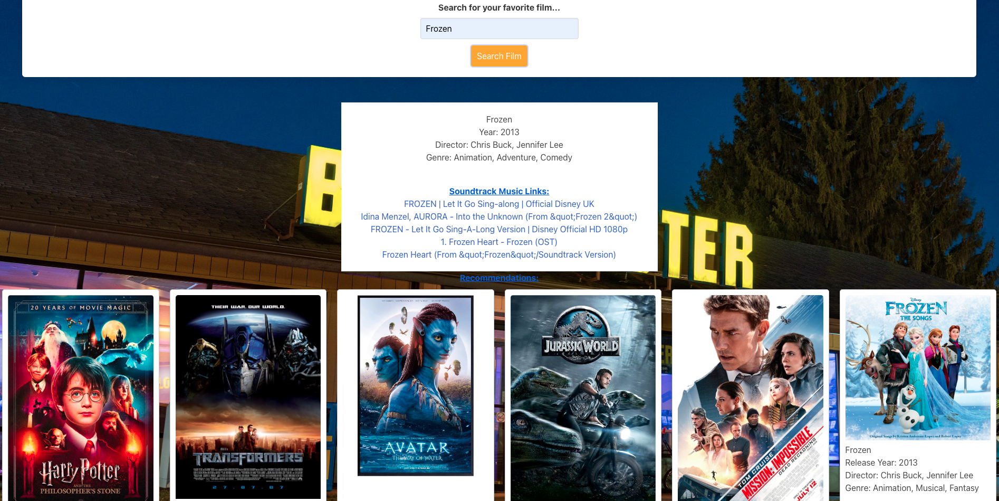

# blockbuster-beats
A web page that will allows you to search for movies and their soundtracks

## Description

This is a webpage that was created using HTML, CSS, Javascript, Bulma, and two server-side APIs. It retrieves data from OMDB and youtube in order to display the movie information and youtube links to the soundtracks/music of the movies that the user searches.

## User Story

As movie enthusiasts, we wanted to be able to look up music and soundtracks to films so that we could relive the music from our favorite movies.

## Installation

N/A

## Acceptance Criteria
The website must allow users to search for movie soundtracks by entering the movie title into the search bar.
Upon entering a movie title, the website should display relevant search results, including the title of the movie and YouTube links from its soundtrack.
The website's user interface should be intuitive and visually appealing, providing a seamless browsing experience.
Users should be able to easily navigate between search results.
The website should be responsive and accessible across different devices and screen sizes.
All search functionality and links must be fully functional and error-free.
The website should load quickly and efficiently, minimizing loading times for users.
The website should maintain data accuracy and relevance, ensuring that search results are up-to-date and reflective of the user's query.
User interactions with the website, such as searching for movies and accessing song links, should be tracked and logged for analytics purposes, if applicable.

## Usage

To use this webpage, the user can type in the name of a movie in the search bar and click the search button. The results will display the movie title, release year, director and genre followed by 5 clickable youtube links of the soundtrack/music which opens in a new window when clicked. When the user types in a movie, that movie will be saved in the search history as a clickable button that will retrieve the information again. The search history will display the last 5 movies typed in.

## Assets

The following images demonstrate the web application's appearance:

 

Here is the link to the deployed application:

## Credits

Acknowledgments: This was a group project with Ismael Madera, Ryan Sarath, and Sarah Davila. Isamel worked on the homepage HTML, code for the modal, Bulma CSS framework, logo, and assisted with the README file. Ryan Sarath worked on HTML for results/recommendation display with the images and the corresponding CSS. Sarah Davila worked on creating the Javascript, ensuring the API's worked properly, and assisted with the README. We also used documentation from youtube and OMDB API's, Xpert Learning Assistant, Module 1-6 activites and mini projects, and developer.mozilla.org (MDN Docs) as resources to create code. Also used information from following website links: 
https://www.omdbapi.com/

https://developers.google.com/youtube/v3/docs/search/list?apix_params=%7B%22part%22%3A%5B%22snippet%22%5D%2C%22q%22%3A%22harry%20potter%20soundtrack%22%2C%22type%22%3A%5B%22video%22%5D%7D#usage

https://stackoverflow.com/questions/36232867/search-videos-by-keyword-using-youtube-data-api-v3

https://blog.hubspot.com/website/how-to-get-youtube-api-key

https://www.youtube.com/watch?v=Bzw2T18YDJ4

## License

MIT License (Please refer to license in repo)
